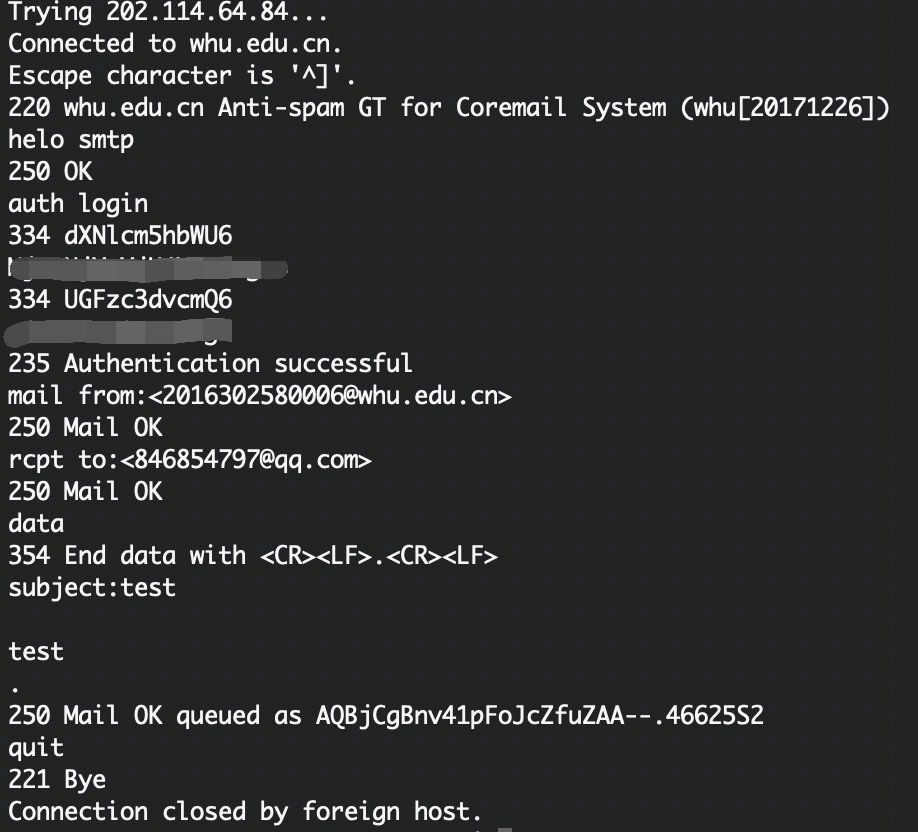
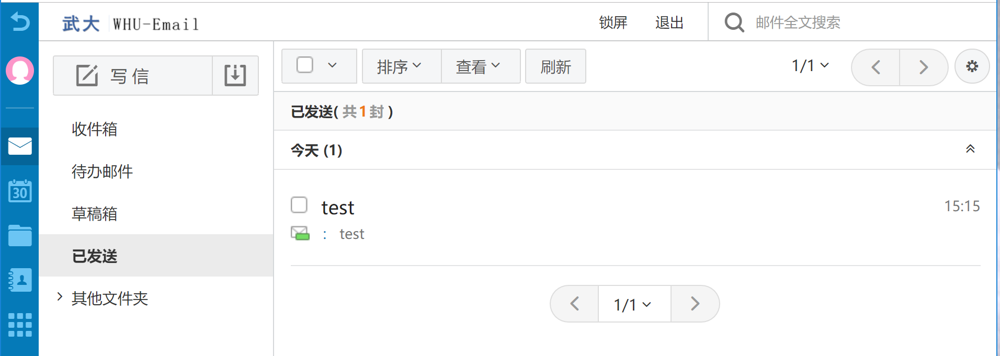
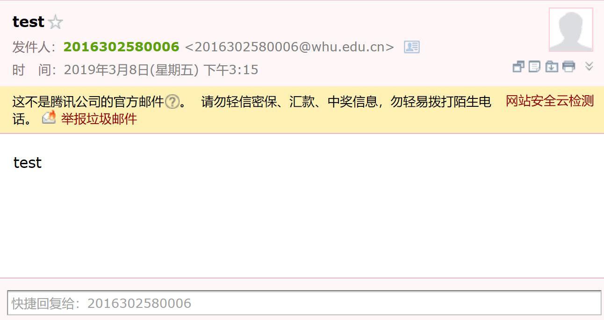

## 1. telnet whu.edu.cn 25

## 2. 习题
- P1.
a. F

b. T

c. F

d. F

e. F
- P3.
运输层：TCP(HTTP需要)，UDP(DNS需要)

应用层：HTTP、DNS
- P4.
a. gaia.cs.umass.edu/cs453/index.html

b. 1.1

c. 持续

d. HTTP报文中没有IP地址

e. Mozilla/5.0  它可以针对不同浏览器发送不同版本的网页
-P5.
a. 能  Tue, 07 Mar 2008 12:39:45GMT

b. Sat, 10 Dec2005 18:27:46GMT

c. 3874

d. <!doc  同意（Kepp-Alive）
- P7.
得到IP地址的时间：RTT1+RTT2+...+RTTn

三次握手+最后的响应：2RTT0

总时间：2RTT0+RTT1+RTT2+...+RTTn
